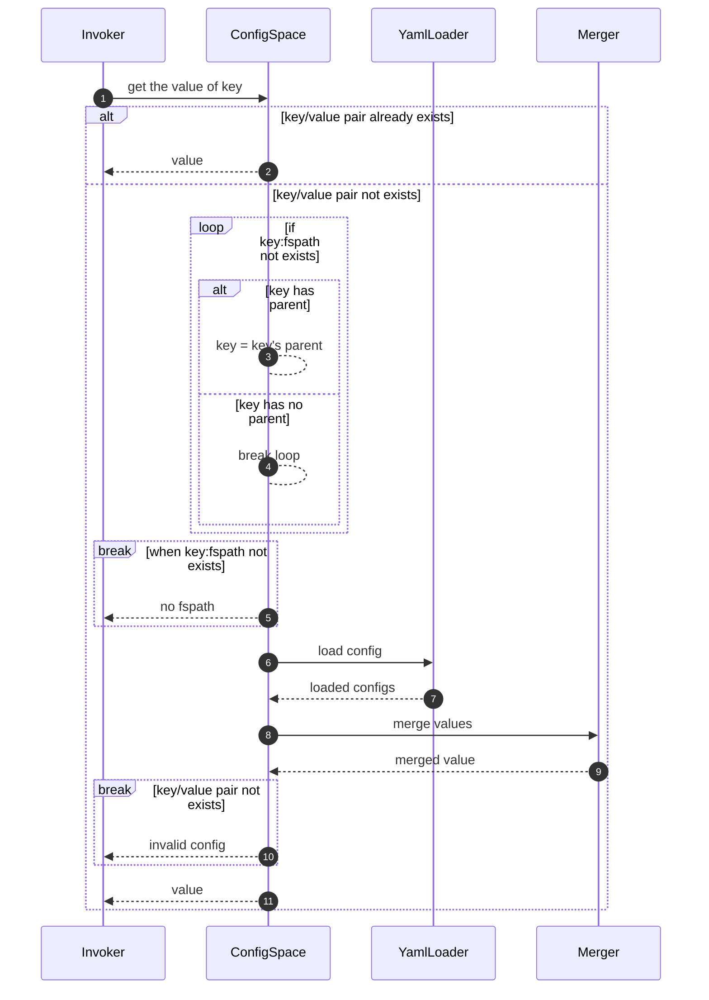
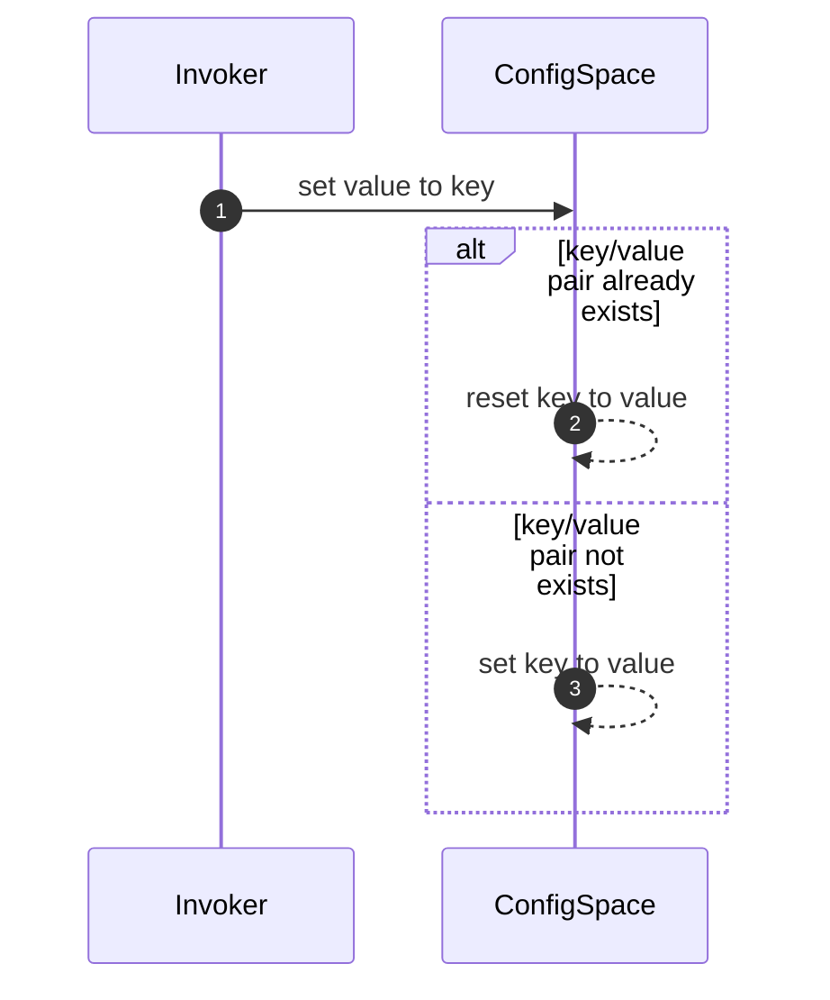
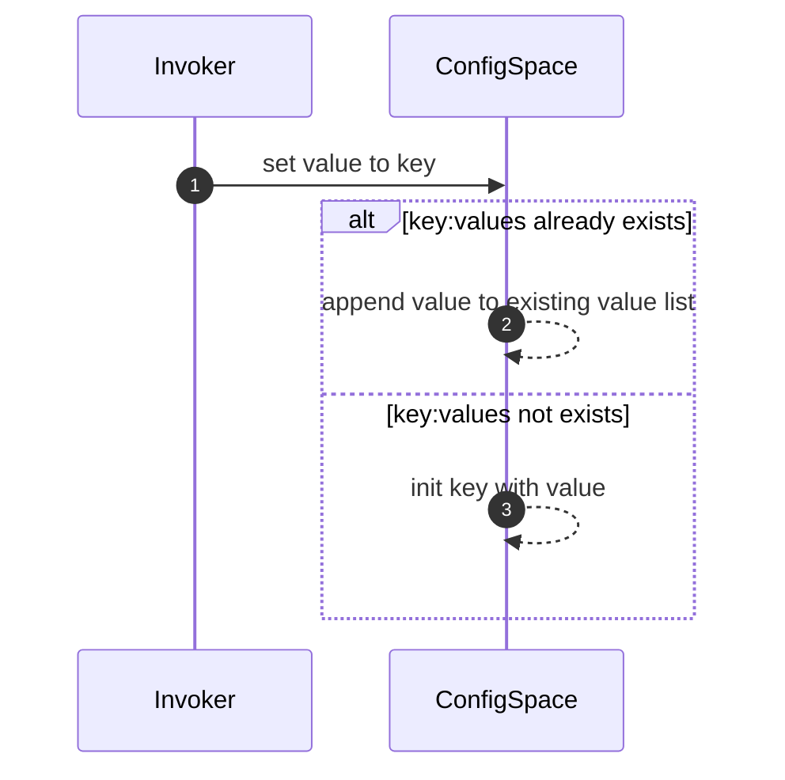

# Config Space

## 模块设计

### 对外接口

#### 接口定义

get(key)

#### 功能

获取指定key对应的value

#### 步骤

- 当前配置空间中*存在*key
   - 返回value
- 当前配置空间中*不存在*key
  - 从key开始逐层从配置空间中尝试获取:fspath
    - 获取:fspath失败
      - 抛出异常
    - 获取:fspath成功
      - 调用YAML Loader加载:fspath对应的配置文件
      - 调用Merger合并key:values
      - 返回key对应的value

#### 输入

`key`: 待查询的key，例如：pkgs.gcc.name

#### 输出

查询的key对应的value，例如：gcc

#### 内部流程



#### 样例

```
def get(key: str) -> Any:
    if ConfigSpace.get(key) is not None:
        return ConfigSpace[key]
    tmp_key = key
    while not (fspath := ConfigSpace.get(tmp_key:fspath)):
        if b := getParent(key):
            tmp_key = b
        else:
            break
    if not fspath:
        raise Exception
    YamlLoader.load(tmp_key, fspath)
    Merger.merger_values(key)
    if ConfigSpace.get(key) is None:
        raise Exception
    return ConfigSpace[key]
```

#### 与其他模块的交互

- 调用YamlLoader模块的load方法加载fspath的配置到配置空间cspath下
- 调用Merger模块合并key:values
- 其他模块调用get方法获取key对应的value

#### 接口定义

set(key, val)

#### 功能

为key设置val

#### 步骤

- 当前配置空间中*存在*key
   - 重置key为val
- 当前配置空间中*不存在*key
  - 添加key/val到配置空间

#### 输入

`key`: 待添加的key，例如：pkgs.gcc.name
`val`: key的值，例如：gcc

#### 输出

无

#### 内部流程



#### 样例

```
def set(key: str, val: Any) -> None:
    ConfigSpace[key] = value
```

### 与其他模块的交互

- Merger模块调用set方法向配置空间添加配置


#### 接口定义

append(key, val, fspath)

#### 功能

为key:values添加val/fspath/when等信息

#### 步骤
- 提取
- 当前配置空间中*存在*key:values
   - 为key:values当前value添加val/fspath/when等信息
- 当前配置空间中*不存在*key:values
  - 添加key:values到配置空间，并初始化value为list，添加val/fspath/when等信息

#### 输入

`key`: 待添加的key，可能包含when信息，例如：pkgs.gcc.name
`val`: key的值，例如：gcc
`fspath`: key的原始配置文件路径，例如/project/layer/pkgs/gcc/gcc.yaml

#### 输出

无

#### 内部流程



#### 样例

```
def set(key: str, val: Any, fspath: str) -> None:
    if ConfigSpace.get(key) is not None:
        ConfigSpace[key].append({value: val, fspath: fspath})
    else
        ConfigSpace[key] = list({value: val, fspath: fspath})
```

### 与其他模块的交互

- LayerLoader和YamlLoader模块调用append方法向配置空间添加配置
