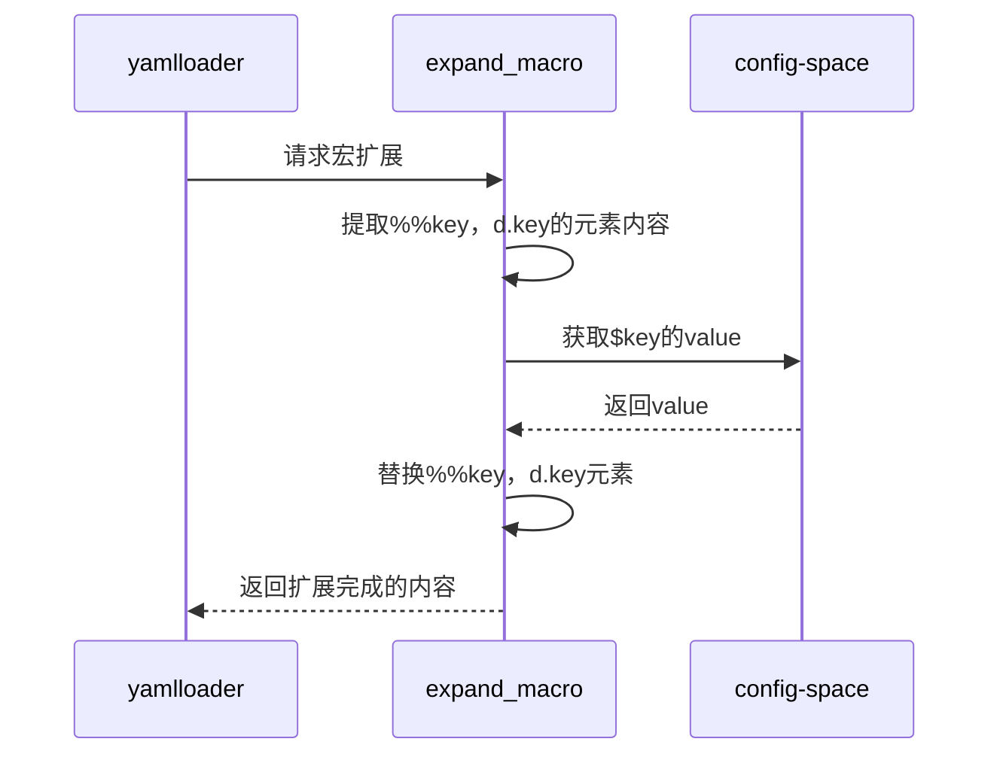

# expand模块设计
## 对外接口

expand_macro(str_macro)

作用:
    对str_macro中的%%{} %%%{} d.xxx, dd.xxx进行展开
步骤:
    使用正则表达是匹配%%{} %%%{} d.xxx, dd.xxx
    获取上面的值
    填入str_macro并返回

input:
    str_macro: 包含%%{} %%%{} d.xxx, dd.xxx的字符串，例如: "d.version + '33.1'"
output:
    value: 返回替换后的str_macro

def expand_macro(str_macro):

// import re，正则匹配
​    keys = re 匹配到的内容
​    sub_values = {}
​    for key in keys:
​        sub_values[key] = config_space.get(key) 
​    return substitute(str_macro, sub_values)

def substitute(str_macro, sub_values):
    # 将%%{} %%%{} d.xxx, dd.xxx的字符串 替换为sub_values对应的值
    return str_macro

"""

## 与其他模块的交互
config_space.get(key) # 如果获取不到key的value，则进行加载yaml后执行