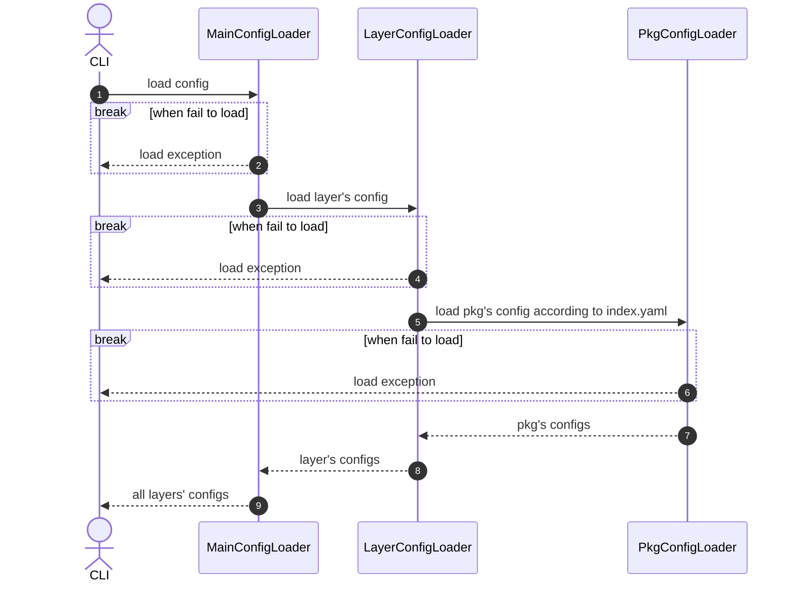

# Layer Loader

## 模块设计

### 对外接口

#### 接口定义

load(config_path)

#### 功能

加载工具入口配置文件，并根据配置搭建`config space`的初始骨架

#### 步骤

1. 加载入口配置文件，获取`layers`
2. 遍历配置的`layers`目录
3. 对每个`layer`，加载其`pkgs`目录下的`index.yaml`，根据`configFilesPattern`匹配`pkgs`目录下的各个`pkg`目录，
将各`pkg`目录对应的`registerConfigSpaceForEachFile`配置加载到`config space`

#### 输入

`config_path`: 工具入口配置文件路径，例如/project/config.yaml

#### 输出

配置空间中的所有layer配置

#### 内部流程



#### 样例

```
def load(config_path: str) -> None:
    layers = yaml.safe_load(open(config_path))
    for layer in layers:
        index = yaml.safe_load(open(layer + "pkgs/index.yaml"))
        for pkg in re.match(index[pattern]):
            for k, v in index[register_items].items():
                config_space[k] = v
```

#### 与其他模块的交互

作为工具入口，为其他模块搭建`config space`的初始骨架
