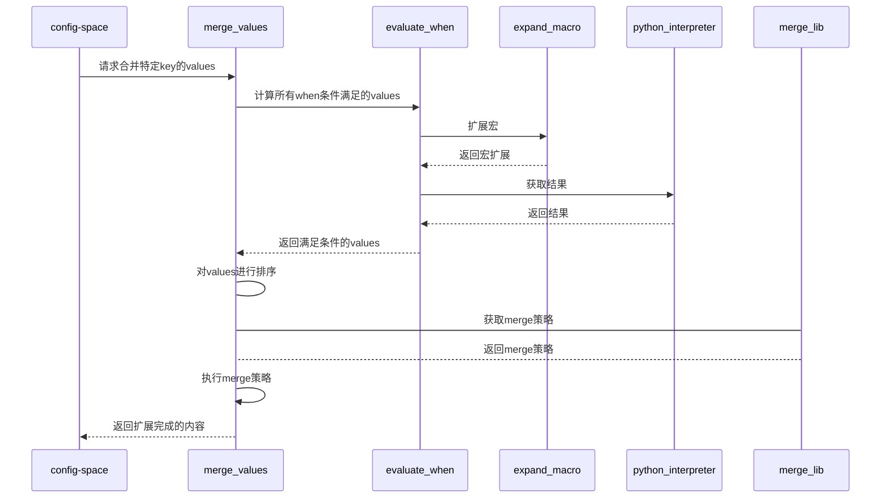

# merge模块设计
## 对外接口

merge_values(key)

作用:
    得到key的最终值
步骤:
    获取config-space中的 key:values
    对所有values的when条件进行计算，保留满足条件的value
    对values进行排序
    根据key的类型，获取key的merge策略
    执行merge策略函数，将得到的结果写入到config-space中
    返回value

input:
    key: 描述要合入的key信息，例如: pkgs.gcc.buildRequires
output:
    value: 返回合入后的值





"""
def merge_values(key):
    values = config-sapce.get(key)
    values = evaluate_when(values) # 返回满足条件的values
    merge_func = merge_lib(key)  # 返回当前key的merge_func
    sorted(values)
    value = merge_func(values)   # 这个执行可能需要传给python解释器
    config-space.set(key, value)

def evaluate_when(values):
    values_temp = []
    for v in values:
        if not merge_value(v.when):
            continue
        v.value = merge_value(v.value)
        values_temp.append(v)
    return values_temp

def merge_lib(key):
    //根据key的内容获取merge_func
​    pass
"""

## 与其他模块的交互
config-space.get(key): 当key不存在时，能够自动加载yaml，# 理论这一步再get时候就已经开始了，不会再此处才加载
merge_value(py.code): 再内部展开 %%{} %%%{} d.xxx, dd.xxx；并调用python解释器执行，返回结果

// 用于values的优先级排序
config-space.get(yaml:origin?):读取yaml的origin的实现
config-space.get(yaml:doctype):读取yaml的doctype的实现
config-space.get(yaml:layerPrio):读取yaml的layerprio的实现


## 内部使用的数据结构

```python
# values的值
values = [{
  "value": "%%key2 + %%%pkgs.gcc.epol",
  "fspath": "/xx/cc1/x1.yaml",
  "when": "{{ 1==d.xxx }}"
},{
  "value": "%%key2 + %%%pkgs.gcc.epol",
  "fspath": "/xx/cc2/x2.yaml",
  "when": "{{ 2==dd.pkgs.gcc.epol }}"
},]
```


