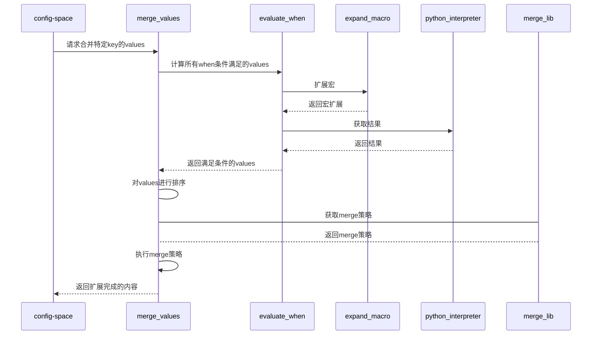

# merge模块设计
## 对外接口

merge_values(key)

作用:
    得到key的最终值
步骤:
    获取config-space中的 key:values
    对所有values的when条件进行计算，保留满足条件的value
    对values进行排序
    根据key的类型，获取key的merge策略
    执行merge策略函数，将得到的结果写入到config-space中
    返回value

input:
    key: 描述要合入的key信息，例如: pkgs.gcc.buildRequires
output:
    value: 返回合入后的值





"""
def merge_values(key):
    values = config-sapce.get(key)
    values = evaluate_when(values) # 返回满足条件的values
    merge_func = merge_lib(key)  # 返回当前key的merge_func
    sorted(values)
    value = merge_func(values)   # 这个执行可能需要传给python解释器
    config-space.set(key, value)

def evaluate_when(values):
    values_temp = []
    for v in values:
        if not merge_value(v.when):
            continue
        v.value = merge_value(v.value)
        values_temp.append(v)
    return values_temp

def merge_lib(key):
    //根据key的内容获取merge_func
​    pass
"""

## 实现yaml中的when条件语句解析

### 原始需求

```
## when expression

when支持and/or/not/()组合起来的复合表达式。优先级规则与python相同，从高到低为：
	()
	in, not in, <, <=, >, >=, !=, ==, =
	! x, not x
	&&, and
	||, or

这这里，我们选择同时支持and or not与 && || !，因为使用不同主力开发语言的开发者，可能有不同的习惯用法。
	ruby: 都支持
	python/jinja: 只支持 and or not
	js/github actions: 只支持 && || ! https://docs.github.com/en/actions/learn-github-actions/expressions

Rule1: =与==含义相同，因为不会在when里做赋值操作。

Rule2: 对
	word1 OP word2
word1/workd2均可以是如下明确形式
	- d/dd变量
	- %%/%%%变量
	- +flag/-flag
	- @version
	- ''/""字符串
	- 数字
如果出现非明确的形式，则约定word1是变量，word2是字符串。
这样方便书写如下形式的条件

	when target = linux-gnux32:
	when arch in aarch64 riscv:

Rule3: 真值、假值判断原则同python，但"off"作为假值处理
假值：null, None, False, false, 0, "", "off", [], {}

```


### 方案思路


#### 对when条件语句进行整合：

```yaml
subpackages.glibc-common when exp1:
	requires when exp2:  
		- "tzdata >= 2003a"
	buildRequires when exp3:
		- "gcc"
```

当前的转换为转换为 

subpackages.glibc-common when exp1.requires when exp2: ["tzdata >= 2003a"]

subpackages.glibc-common when exp1.buildRequires when exp3: ["gcc"]

=>

subpackages.glibc-common.requires when exp1 and exp2: ["tzdata >= 2003a"]

subpackages.glibc-common.buildRequires when exp1 and exp3: ["gcc"]


#### 对exp中的变量形式进行展开

	- d/dd变量
	- %%/%%%变量
	- +flag/-flag
	- @version
	- ''/""字符串
	- 数字


#### 实现when语句的复合语句解析

```
when支持and/or/not/()组合起来的复合表达式。优先级规则与python相同，从高到低为：
	()
	in, not in, <, <=, >, >=, !=, ==, =
	! x, not x
	&&, and
	||, or
```


### 方案实现

#### 对when条件语句进行整合

**实现方法**

脚本约束，要求每个字段中，最多只有一个when条件；

```python
prefix = "subpackages.glibc-common when exp1"
key = "requires when exp2"

if "when" in prefix:
  prefix_new = subpackages.glibc-common
  prefix_when_statement = exp1
 
if "when" in key:
  key = key + "&&" + prefix_when_statement
else:
  key = key + "when " + prefix_when_statement
```


#### 对exp中的变量形式进行展开

对when语句中的变量进行替换

```
- +flag/-flag
- @version
```

使用when关键字提取出key及when语句。对when语句中的条件进行替换。

```
+flag => %%deflags.flag
-flag => not %%deflags.flag
@version => %%version
```


#### 实现when语句的复合语句解析

由于使用复合语句，可能会有多种条件合并及运算，基于当前字符串正则匹配的方法实现较为复杂。

@version > "3.45" and +flag_a or -flag_b && ( %%{release} > "7" )


考虑实现一个简单的词法及语法解析能力，也能够方便日后做扩展。选用python自身所拥有的ply类库，能够通过简单的定义，实现lex及parser的解析和执行能力

```python
# 定义语法分析器 定义优先级
precedence = (
    ('left', 'OR', 'OR2', 'AND', 'AND2'),
    ('left', 'NOT'),
    ('left', 'NOT2'),
    ('nonassoc', 'EQUAL', 'EQUAL2', 'NOT_EQUAL', 'GREATER', 'LESS', 'GREATER_EQUAL', 'LESS_EQUAL'),
    ('left', 'IN'),
    ('left', 'PLUS', 'MINUS'),
    ('left', 'TIMES', 'DIVIDE'),
    ('right', 'UMINUS'),
    ('nonassoc', 'STRING'),
    ('left', 'LSQUARE'),
    ('left', 'NOTIN'),
)


# list的语法解析
def p_expression_list_items(p):
    '''expression_list_ex : expression_list_ex expression
                       | expression'''
    if len(p) == 3:
        p[1].append(p[2])
        p[0] = p[1]
        return

    if type(p[1]) == list:
        p[0] = p[1]
    else:
        p[0] = [p[1]]

def p_expression_list_convert(p):
    '''expression_list : expression_list_ex
                       | LSQUARE expression_list_ex RSQUARE'''
    if len(p) == 4:
        p[0] = p[2]
        return
    p[0] = p[1]


def p_expression_in(p):
    "expression : expression IN expression_list"
    p[0] = p[1] in p[3]

def p_expression_notin(p):
    "expression : expression NOTIN expression_list"
    p[0] = p[1] not in p[3]
```


## 与其他模块的交互
config-space.get(key): 当key不存在时，能够自动加载yaml，# 理论这一步再get时候就已经开始了，不会再此处才加载
merge_value(py.code): 再内部展开 %%{} %%%{} d.xxx, dd.xxx；并调用python解释器执行，返回结果

// 用于values的优先级排序
config-space.get(yaml:origin?):读取yaml的origin的实现
config-space.get(yaml:doctype):读取yaml的doctype的实现
config-space.get(yaml:layerPrio):读取yaml的layerprio的实现


## 内部使用的数据结构

```python
# values的值
values = [{
  "value": "%%key2 + %%%pkgs.gcc.epol",
  "fspath": "/xx/cc1/x1.yaml",
  "when": "{{ 1==d.xxx }}"
},{
  "value": "%%key2 + %%%pkgs.gcc.epol",
  "fspath": "/xx/cc2/x2.yaml",
  "when": "{{ 2==dd.pkgs.gcc.epol }}"
},]
```


