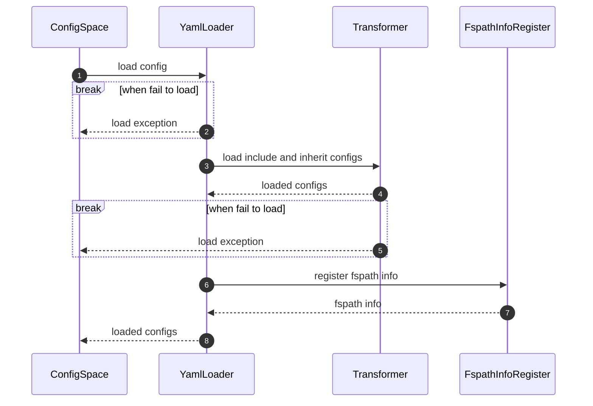

# YAML Loader

## 模块设计

### 对外接口

#### 接口定义

load(cspath, fspath)

#### 功能

加载指定配置文件到指定配置空间路径

#### 步骤

1. 加载指定配置文件
2. 以指定配置空间为前缀，平铺加载各配置项
3. 调用transform加载include和inherit配置
4. 在配置空间注册文件信息

#### 输入

`cspath`: 配置空间路径，例如：pkgs.gcc

`fspath`: 配置文件路径，例如/project/layer/pkgs/gcc/gcc.yaml

#### 输出

指定文件及相关文件在配置空间中的配置

#### 内部流程



#### 样例

```
def load(cspath: str, fspath: str) -> None:
    configs = yaml.safe_load(open(cspath))
    for config, val in configs:
        config_space[f"{cspath}.{config}"] = val
    transform()
    registerFspathInfo(cspath, fspath)
```

#### 与其他模块的交互

- ConfigSpace：加载配置文件到指定配置空间路径
